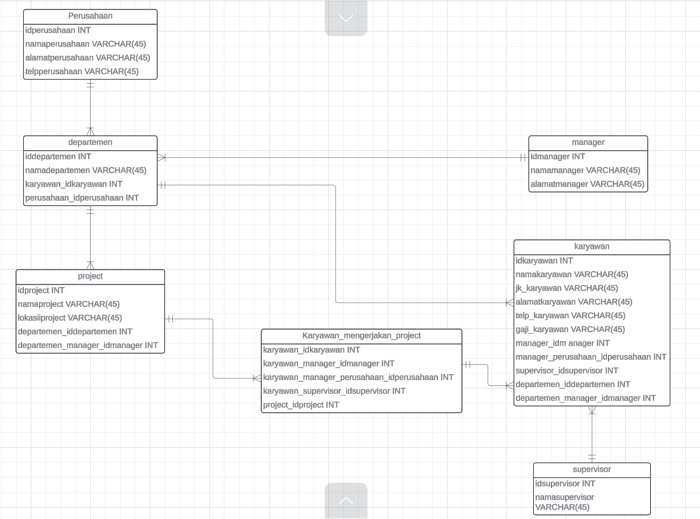

# Tugas Praktikum { Pertemuan ke 13 }
 

 ## Profil
|  |  |
| -------- | --- |
| **Nama** | Muhammad Faiz Iqbal |
| **Kelas** | TI.23.A.5 |
| **Mata Kuliah** | Basis data |

# Studi Kasus: ERD Karyawan

## Soal Latihan

Sebuah perusahaan ingin membuat sistem untuk pengeloalaan data karyawan pada perusahaan , dengan ketentuan sebagai berikut :

-  Perusahaan tersebut terdiri dari beberapa depatemen yang di pimpin oleh seorang manager (Manajer merupakan bagian dari karyawan).
-  Karyawan bekerja pada salah satu departemen.
-  Karyawan memiliki atasan langsung seorang supervisor.
-  Seorang supervisor dapat membawahi dapat karyawan.
-  Setiap karyawan dari lintas departemen dapat bekerja pada satu project yang sama dalam satu waktu.
-  Setiap karyawan dapat mengerjakan beberapa project yang berbeda.

Buatlah desain databasenya (ER-Diagram), beserta tabel datanya ?

## SELESAI  
## TERIMAKASIH
